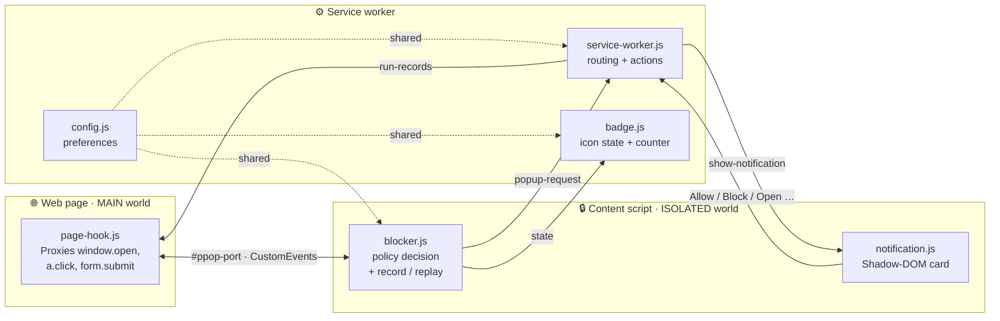
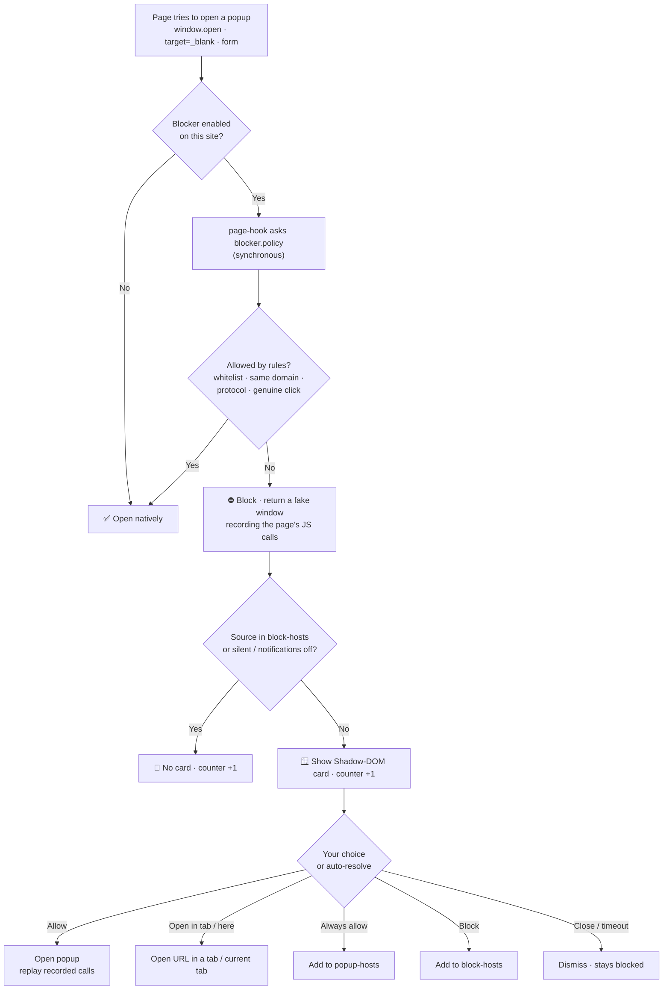

<div align="center">

# 🛡️ Block PopUP

**A strict, modern popup blocker for Chrome & Edge (Manifest V3).**
Intercepts popups *before* they open — no tracking, no external calls, no build step.

[](https://github.com/carmelobattiato/Block-PopUP/actions/workflows/ci.yml)

<br/>

</div>

---

## 🚀 Manual install (1 minute)

1. **Download** this repository (green **Code → Download ZIP**, then unzip) or clone it:
   ```bash
   git clone https://github.com/carmelobattiato/Block-PopUP.git
   ```
2. Open **`chrome://extensions`** (or `edge://extensions`).
3. Toggle **Developer mode** ON (top‑right).
4. Click **Load unpacked** and select the project folder (the one containing **`manifest.json`**).
5. Pin the 🛡️ icon and you're done — the extension protects every tab immediately.

> No build, no dependencies: it's plain JavaScript loaded as‑is.

---

## ✨ What it does

Block PopUP catches popup attempts at the source and lets **you** decide, with a clean
in‑page card that never disrupts the site you're reading.

| | Feature |
|---|---|
| 🎯 | **Pre‑emptive blocking** of `window.open`, `target=_blank` links and form submissions, in every frame |
| 🪟 | **Modern notification** rendered in an isolated **Shadow DOM** (rounded card, auto dark/light) |
| 🔘 | One‑tap actions: **Allow**, **Block**, **Close**, plus **⋯ More** → *Open in tab · Open here · Always allow* |
| 🚫 | **Always‑block list** — silence a domain forever: no card, only the counter keeps counting |
| ⏱️ | **Auto‑resolve** with a visible countdown on the chosen default action (Close / Block / …) |
| 🧭 | **Toolbar panel**: global on/off, per‑site on/off (+ sub‑frames), blocked count, *Allow / Block last*, recent blocked list |
| 🔀 | **Redirect protection** — optionally block sneaky page redirects (incl. automated ones) |
| 🔒 | **Private by design** — no analytics, no remote requests, all settings in local storage |
| 💾 | **Import / Export** your configuration as JSON |
| 📢 | **Block ads by domain** — right‑click any ad → *Block ads from this domain* to block that ad domain only on the current site (network‑level, via `declarativeNetRequest` scoped by initiator) |
| 🌀 | **Wildcard patterns** in domain lists — e.g. `*.example.com`, `tracker-*.net`, `*ads*` |
| ↩️ | **Undo** — *Block this site* shows a 5‑second toast to revert an accidental block |
| 🔁 | **Sync across devices** — optional switch mirrors all settings via `chrome.storage.sync` |

---

## 🧩 Architecture

Two execution worlds talk through a hidden DOM `#ppop-port` element using **synchronous**
CustomEvents, so the block decision happens *before* `window.open()` returns.



---

## 🔄 How a popup is handled



---

## ⚙️ Options

Open the panel (🛡️ icon) → **Options**, organised in cards:

- **General** — enable, show notifications, badge + colour, position (tl/tr/bl/br), **default action** (Do nothing / Close / Block / Open in tab / Open here), auto‑resolve seconds, max notifications, width.
- **Domain lists** — *allowed popup sources*, *disabled sites*, *always‑blocked domains*, **blocked ad domains**. Each list has a filter box for quick lookup in long lists.
- **Redirect protection** — block page redirects and automated redirects.
- **Sync** — mirror all settings across devices via `chrome.storage.sync` (optional; gracefully handles quota limits).
- **Backup** — Import / Export / Reset to defaults.

---

## 🗂️ Project structure

```text
manifest.json                  # MV3 manifest
src/
├─ background/
│  ├─ service-worker.js         # registers content scripts, routes messages & actions
│  ├─ config.js                 # default preferences (chrome.storage.local)
│  ├─ badge.js                  # toolbar icon state + per-tab blocked counter
│  ├─ adblock.js                # context-menu ad blocker, declarativeNetRequest rules (per-site)
│  └─ history.js                # per-tab blocked-popup history
├─ content/
│  ├─ page-hook.js              # MAIN world — hooks the popup APIs
│  ├─ blocker.js                # ISOLATED world — redirect guard, record/replay, messaging
│  ├─ policy.js                 # pure block-decision engine (unit-tested)
│  ├─ notification.js           # ISOLATED world — Shadow-DOM notification card
│  ├─ disabled.js               # marks excluded top sites
│  └─ probe.js                  # validates match patterns
├─ action/                      # toolbar panel (popup.html/js/css) + tld.js
├─ options/                     # options page (options.html/js/css)
└─ assets/icons/                # 16–512 + per-state toolbar icons
test/
├─ popups.html                  # local self-test page (no external URLs)
└─ policy.test.js               # unit tests for the block-decision engine
```

**Tech:** Manifest V3 · vanilla JavaScript (ESM where native) · no bundler · no runtime dependencies.

---

## 🧪 Testing

- **Manual:** load the extension, then open **`test/popups.html`** directly in the browser and click each
  trigger (`window.open`, `target=_blank` link, form submit, delayed, burst, magnet, genuine gesture).
- **Unit (no install needed):** the pure block-decision engine in `src/content/policy.js` is covered by
  `test/policy.test.js`:
  ```bash
  npm test          # node --test
  npm run lint      # syntax-check every JS file
  npm run validate  # validate manifest.json
  ```
- **CI:** every push / PR runs lint + manifest validation + unit tests via GitHub Actions; tagging `v*`
  builds a packaged `block-popup-<tag>.zip`.

---

## 🔐 Permissions

| Permission | Why |
|---|---|
| `storage` | save your preferences locally |
| `scripting` | register the in‑page blocking scripts |
| `contextMenus` | right‑click *Block ads from this domain* menu item |
| `declarativeNetRequest` | network‑level ad blocking rules scoped per site |
| `<all_urls>` | a popup can come from any site |

No data ever leaves your browser.

---

## 👤 Credits & License

Made by **[Carmelo Battiato](https://github.com/carmelobattiato/Block-PopUP)**.

Released under the **MIT** license — see [LICENSE](LICENSE).
Bundles **tld.js** for domain parsing (MIT).
